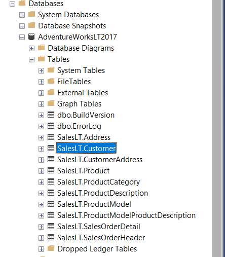

# End-to-End Azure Data Engineering Solution

This project presents a complete Azure-based data engineering pipeline, starting from a local SQL database and ending with dynamic reporting in Power BI, all set up for automated processing.

## Project Overview
- **Dataset**: AdventureWorks 

- **Local Environment**: Hosted on-premises Microsoft SQL Server.
- **Database Management**: Microsoft SQL Server Management Studio for importing and managing the dataset.

### 1. Data Ingestion

Data is ingested from the local SQL Server to Azure SQL using Azure Data Factory. The steps involved include:

- **Integration Runtime**: Installation of the Self-Hosted Integration Runtime to enable connectivity.
- **Pipeline Setup**: Azure Data Factory is connected to the local SQL server, and a copy pipeline is configured to transfer tables to the Azure Data Lake “bronze” layer.

### 2. Data Transformation

The transformation process adheres to the medallion data lake architecture, where data flows from “bronze” (raw data) to “silver” (cleaned data) and finally to “gold” (optimized data for reporting). The steps include:

- **Tool**: Azure Databricks with PySpark handles the transformation stages.
- **Data Format**: Data starts in parquet format in the bronze layer, then moves to delta format as it progresses to the silver and gold layers.
- **Transformation Process**: 
  - Storage is mounted in Databricks.
  - Data is cleaned and transformed from bronze to silver.
  - Data is further refined from silver to gold.
- **Automation**: Azure Data Factory is configured to trigger Databricks notebooks to handle each transformation step.

### 3. Data Loading

For loading, data from the gold layer is integrated into Power BI through Azure Synapse. This process includes:

- **Connection**: Creating a link from Azure Storage (gold layer) to Azure Synapse.
- **SQL Views**: Stored procedures are written to extract table data as SQL views, which are then stored in a serverless SQL database in Synapse.

### 4. Data Reporting

Power BI connects to the data pipeline using DirectQuery to ensure that reports are dynamically updated. A Power BI dashboard is built to visualize the AdventureWorks dataset, showing metrics such as sales, product details, and customer demographics.

## Summary and Considerations

This project demonstrates the end-to-end creation of a cloud-based ETL pipeline on Azure. BI.

